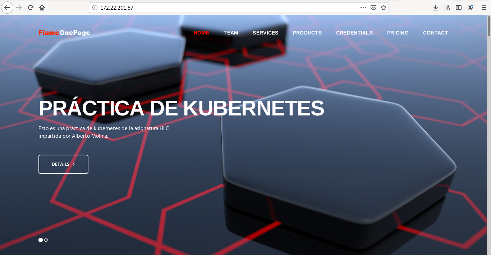
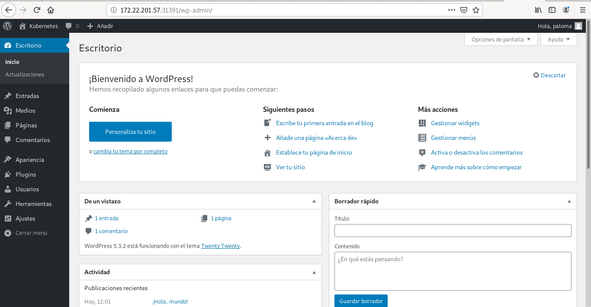

# Kubernetes
Para esta práctica se va a utilizar una máquina vagrant con sistema operativo Debian Buster. 

### Instalación de Docker
La manera de instalar Docker en Debian es muy sencilla, a través de los repositorios oficiales, donde está disponible el paquete **docker.io** 
~~~
sudo apt install docker.io
~~~

Esta es la versión de Docker que hemos instalado:
~~~
debian@kubernetes:~$ docker --version
Docker version 18.09.1, build 4c52b90
~~~

### Creación de una imagen Docker
Se va a crear una imagen Docker para ser utilizada por los contenedores de nuestro escenario. 

Se ha creado un directorio con el siguiente contenido:
~~~
debian@kubernetes:~/kubernetes/public_html$ ls
css  img  index.html  js  sass  vendor
~~~

Se va a crear un fichero Dockerfile con el siguiente contenido:
~~~
FROM debian
RUN apt-get update -y && apt-get install -y \
    apache2 \
    && apt-get clean && rm -rf /var/lib/apt/lists/*
COPY ./public_html /var/www/html/
ENTRYPOINT ["/usr/sbin/apache2ctl", "-D", "FOREGROUND"]
~~~

Con esta configuración, a partir de una imagen base, **Debian**, se va a instalar **apache2**, se copia el contenido de **/public_html** en **/var/www/html/** y con entrypoint se indica el proceso que ejecutará el contenedor. 

La sintaxis para crear una imagen es la siguiente:
~~~
docker build -t <usuario>/<nombre_imagen>:<versión> <ruta_creación>
~~~

En nuestro caso, la creación de la imagen se realizaría de la siguiente forma:
~~~
debian@kubernetes:~/kubernetes$ sudo docker build -t palomar88/kubernetes:v1 .
Sending build context to Docker daemon  4.427MB
Step 1/4 : FROM debian
latest: Pulling from library/debian
50e431f79093: Pull complete 
Digest: sha256:a63d0b2ecbd723da612abf0a8bdb594ee78f18f691d7dc652ac305a490c9b71a
Status: Downloaded newer image for debian:latest
 ---> 971452c94376
Step 2/4 : RUN apt update -y         && apt install -y apache2         && apt clean && rm -rf /var/lib/apt/lists/*
 ---> Running in 92edb44161aa

...

Removing intermediate container 92edb44161aa
 ---> 57062dc8d1e1
Step 3/4 : COPY ./public_html /var/www/html/
 ---> f4ba811ebb59
Step 4/4 : ENTRYPOINT ["/usr/sbin/apache2ctl", "-D", 'FOREGROUND"]
 ---> Running in e46a950da709
Removing intermediate container e46a950da709
 ---> cef3343b902d
Successfully built cef3343b902d
Successfully tagged palomar88/kubernete:v1
~~~

Las imágenes que se tienen disponibles tras la subida de la imagen son:
~~~
debian@kubernetes:~/kubernetes$ sudo docker image ls
REPOSITORY             TAG                 IMAGE ID            CREATED             SIZE
palomar88/kubernetes   v1                  83a7ce903fdd        5 seconds ago       230MB
debian                 latest              971452c94376        7 days ago          114MB
~~~

### Creación de un contenedor Docker
Para la creación de un contenedor se va a utilizar la siguiente sintaxis:
~~~
docker run --name <nombre_contenedor> -d -p <puerto>:<puerto> <usuario_docherHub>/<imagen>:<versión>
~~~

Algunas de las opciones que se indican son:
- **-d**: indica que va a ser un demonio y va a estar continuamente ejecutándose.
- **-p**: posibilita el mapeo de puertos. 

Se crea el contenedor:
~~~
debian@kubernetes:~/kubernetes$ sudo docker run -d --name aplkubertenes -p 80:80 palomar88/kubernetes:v1
62210cf9a38746eefabd6bc6312d2f98456275e6dd038b69b9ecb2a09f947aa1
~~~

Y así aparece el contenedor en funcionamiento:
~~~
debian@kubernetes:~/kubernetes$ sudo docker ps
CONTAINER ID        IMAGE                     COMMAND                  CREATED             STATUS              PORTS                NAMES
62210cf9a387        palomar88/kubernetes:v1   "/usr/sbin/apache2ct…"   56 seconds ago      Up 54 seconds       0.0.0.0:80->80/tcp   aplkubertenes
~~~

Y, con la ip de la máquina anfitriona, podemos acceder a la aplicación web:

### Subir la imagen a DockerHub
Por último, se va a subir la imagen a dockerHub con nuetro usuario para usarla posteriormente con Kubernetes.
~~~
debian@kubernetes:~/kubernetes$ sudo docker login
Login with your Docker ID to push and pull images from Docker Hub. If you don't have a Docker ID, head over to https://hub.docker.com to create one.
Username: palomar88
Password: 
WARNING! Your password will be stored unencrypted in /root/.docker/config.json.
Configure a credential helper to remove this warning. See
https://docs.docker.com/engine/reference/commandline/login/#credentials-store

Login Succeeded
debian@kubernetes:~/kubernetes$ sudo docker push palomar88/kubernetes:v1
The push refers to repository [docker.io/palomar88/kubernetes]
c6cdd6d55e3d: Pushed 
74d1bdea5f60: Pushed 
1c76bd0dc325: Mounted from library/debian 
v1: digest: sha256:2b51171775350d21fc26321545a8769d5ec0e8348069c3b9568fbd71971ffa09 size: 952
~~~

### Instalación de Kubernetes
Kubernetes es un orquestador de contenedores.

Para esta práctica se ha creado un escenario con 3 máquinas, una máster (kubemaster) y dos clientes (kubeminion1 y kubeminion2), en Debian. Todos estos pasos que explican a continuación se realizarán en las 3.

#### Configuración de iptables
Es importante cambiar el gestor del cortafuegos, ya que kubernetes utiliza iptables y el sistema en el que nos encontramos utiliza nftables. Para ello se instala:
~~~
sudo apt install -y iptables arptables ebtables
~~~

Y se cambia la versión a legacy:
~~~
sudo update-alternatives --set iptables /usr/sbin/iptables-legacy
sudo update-alternatives --set ip6tables /usr/sbin/ip6tables-legacy
sudo update-alternatives --set arptables /usr/sbin/arptables-legacy
sudo update-alternatives --set ebtables /usr/sbin/ebtables-legacy
~~~

El resultado es el siguiente:
~~~
debian@kubemaster:~$ sudo update-alternatives --set iptables /usr/sbin/iptables-legacy
update-alternatives: using /usr/sbin/iptables-legacy to provide /usr/sbin/iptables (iptables) in manual mode
debian@kubemaster:~$ sudo update-alternatives --set ip6tables /usr/sbin/ip6tables-legacy
update-alternatives: using /usr/sbin/ip6tables-legacy to provide /usr/sbin/ip6tables (ip6tables) in manual mode
debian@kubemaster:~$ sudo update-alternatives --set arptables /usr/sbin/arptables-legacy
update-alternatives: using /usr/sbin/arptables-legacy to provide /usr/sbin/arptables (arptables) in manual mode
debian@kubemaster:~$ sudo update-alternatives --set ebtables /usr/sbin/ebtables-legacy
update-alternatives: using /usr/sbin/ebtables-legacy to provide /usr/sbin/ebtables (ebtables) in manual mode
~~~

#### Instalación de Docker y del repositorio de Docker

En primer lugar se actualizan las máquinas y se instala docker:
~~~
sudo apt install docker.io
~~~

Se necesitan los siguientes paquetes:
- **apt-transport-https**: para poder utilizar repositorios con https.
- **ca-certificates**: que contiene certificados de las autoridades certificadoras más comunes.
- **curl**: herramienta para transferir datos desde o hacia un servidor.
- **gnupg2**: herramienta para la comunicación sergura y el almacenamiento de datos. Se puede utilizar para cifrar datos y crear firmas digitales. 
- **software-properties-common**: proporciona una abstracción de los repositorios apt utilizados permitiendo administrar fácilmente su distribución y las fuentes de software de proveedores independientes. 

Por lo tanto, se instalan todos estos paquetes:
~~~
sudo apt-get install \
     apt-transport-https \
     ca-certificates \
     curl \
     gnupg2 \
     software-properties-common
~~~

Se añade las claves oficiales de Docker:
~~~
debian@kubemaster:~$ curl -fsSL https://download.docker.com/linux/debian/gpg | sudo apt-key add -
OK
~~~

Y se agrega el repositorio:
~~~
sudo add-apt-repository \
  "deb [arch=amd64] https://download.docker.com/linux/debian \
  $(lsb_release -cs) \
  stable"
~~~

Para finalizar se instala docker:
~~~
sudo apt update
sudo apt install docker-ce
~~~

### Instalación de kubernetes con kubeadm
Se va a instalar kubeadm en las tres máquinas, y, por dependencias kubelet para ejecutar los nodos y kubectl que nos permite controlar el cluster desde la línea de comandos.

Para ellos, en todas las máquinas se hará lo siguiente:

Descargar la clabe GPG de kubernetes:
~~~
root@kubemaster:~# curl -s https://packages.cloud.google.com/apt/doc/apt-key.gpg | apt-key add -
OK
~~~

Se añade el repositorio:
~~~
cat <<EOF >/etc/apt/sources.list.d/kubernetes.list
deb http://apt.kubernetes.io/ kubernetes-xenial main
EOF
~~~

Y tras actualizar el sistema se isnala kubeadm:
~~~
sudo apt update
sudo apt install kubeadm
~~~

#### Configuración del nodo master
Se ejecuta la siguiente instrucción como superusuario:
~~~
kubeadm init --pod-network-cidr=<CIDR_interna> --apiserver-cert-extra-sans=<ip_master>
~~~

> La CIDR interna es una red interna que creará kubernetes para conectar los nodos. 

~~~
root@kubemaster:~# kubeadm init --pod-network-cidr=192.168.0.0/16 --apiserver-cert-extra-sans=172.22.201.57
W0306 10:56:03.533086   15604 validation.go:28] Cannot validate kube-proxy config - no validator is available
W0306 10:56:03.533206   15604 validation.go:28] Cannot validate kubelet config - no validator is available
[init] Using Kubernetes version: v1.17.3
[preflight] Running pre-flight checks
	[WARNING IsDockerSystemdCheck]: detected "cgroupfs" as the Docker cgroup driver. The recommended driver is "systemd". Please follow the guide at https://kubernetes.io/docs/setup/cri/
[preflight] Pulling images required for setting up a Kubernetes cluster
[preflight] This might take a minute or two, depending on the speed of your internet connection
[preflight] You can also perform this action in beforehand using 'kubeadm config images pull'
...
Your Kubernetes control-plane has initialized successfully!

To start using your cluster, you need to run the following as a regular user:

  mkdir -p $HOME/.kube
  sudo cp -i /etc/kubernetes/admin.conf $HOME/.kube/config
  sudo chown $(id -u):$(id -g) $HOME/.kube/config

You should now deploy a pod network to the cluster.
Run "kubectl apply -f [podnetwork].yaml" with one of the options listed at:
  https://kubernetes.io/docs/concepts/cluster-administration/addons/

Then you can join any number of worker nodes by running the following on each as root:

kubeadm join 10.0.0.14:6443 --token 3ibk6h.mprsa187s016w4sl \
    --discovery-token-ca-cert-hash sha256:4da65a6d8ef6099c1b6da98b260e8269022ac5dd645e861c4c8b89b6a415402c 
~~~

Al final del mensaje de iniciación de kubeadm, además de darnos la información necesaria para manejar el cluster y las instrucciones para añadir nodos a este, indica que para iniciar el cluster se tiene que crear un pod para gestionar la red.

Se comienza con el primer mensaje, la creación del entorno de usuario, para ello:
~~~
debian@kubemaster:~$ mkdir -p $HOME/.kube
debian@kubemaster:~$ sudo cp -i /etc/kubernetes/admin.conf $HOME/.kube/config
debian@kubemaster:~$ sudo chown $(id -u):$(id -g) $HOME/.kube/config
~~~

Y se instala un pod que permita la comunicación por red de los distintos pods ya que kubeadm solo soporta plugings de red Container Network Interface, para ello se instala Weave:
~~~
debian@kubemaster:~$ kubectl apply -f "https://cloud.weave.works/k8s/net?k8s-version=$(kubectl version | base64 | tr -d '\n')"
serviceaccount/weave-net created
clusterrole.rbac.authorization.k8s.io/weave-net created
clusterrolebinding.rbac.authorization.k8s.io/weave-net created
role.rbac.authorization.k8s.io/weave-net created
rolebinding.rbac.authorization.k8s.io/weave-net created
daemonset.apps/weave-net created
~~~

Y se comprueba que todos los espacios de nombres estén en uso:
~~~
debian@kubemaster:~$ kubectl get pods -n kube-system
NAME                                 READY   STATUS    RESTARTS   AGE
coredns-6955765f44-n8xtj             1/1     Running   0          3m13s
coredns-6955765f44-rrkmj             1/1     Running   0          3m13s
etcd-kubemaster                      1/1     Running   0          3m26s
kube-apiserver-kubemaster            1/1     Running   0          3m26s
kube-controller-manager-kubemaster   1/1     Running   0          3m26s
kube-proxy-8gxrw                     1/1     Running   0          3m13s
kube-scheduler-kubemaster            1/1     Running   0          3m26s
weave-net-tq6mp                      2/2     Running   0          56s
~~~

#### Unión de los nodos
En cada nodo hay que ejecutar el comando que apareción al finalizar la instalación de kubeadm:
~~~
kubeadm join 10.0.0.14:6443 --token 3ibk6h.mprsa187s016w4sl \
    --discovery-token-ca-cert-hash sha256:4da65a6d8ef6099c1b6da98b260e8269022ac5dd645e861c4c8b89b6a415402c 
~~~

Tras introducir el comando en los dos nodos clientes, se comprueba en el master que se han conectado correctamente:
~~~
debian@kubemaster:~$ kubectl get nodes
NAME          STATUS   ROLES    AGE     VERSION
kubemaster    Ready    master   7m7s    v1.17.3
kubeminion1   Ready    <none>   2m32s   v1.17.3
kubeminion2   Ready    <none>   2m39s   v1.17.3
~~~

### Despliegue de una aplicación en kubernetes
#### Despliegue de maria

En primer lugar se va a crear un fichero con la siguiente información:
~~~
apiVersion: v1
kind: Namespace
metadata:
  name:wordpress
~~~

Para crearlo se utiliza el siguiente comando:
~~~
kubectl create ns <fichero>
~~~

Y se crea:
~~~
debian@kubemaster:~/wordpress$ kubectl create ns wp-namespaces 
namespace/wp-namespaces created
~~~

Comprobación:
~~~
debian@kubemaster:~/wordpress$ kubectl describe ns wp-namespace 
Name:         wp-namespaces
Labels:       <none>
Annotations:  <none>
Status:       Active

No resource quota.

No LimitRange resource.
~~~

Se va a generar un secreto para la password de mysql. Para ello se crea un fichero con extensión .yaml con la siguiente sintaxis:
~~~
kubectl create secret generic mariadb-secret --namespace=<namespace>\
                            --from-literal=dbuser=<usuario> \
                            --from-literal=dbname=<base de datos> \
                            --from-literal=dbpassword=<contraseña> \
                            --from-literal=dbrootpassword=<contraseña_root> \
                            -o yaml --dry-run > <fichero>.yaml
~~~

En nuestro caso, la configuración sería la siguiente:
~~~
kubectl create secret generic mariadb-secret --namespace=wp-namespaces\
                            --from-literal=dbuser=user_wordpress \
                            --from-literal=dbname=wordpress \
                            --from-literal=dbpassword=password1234 \
                            --from-literal=dbrootpassword=root1234 \
                            -o yaml --dry-run > secret-maria.yaml
~~~

Y se crea el secreto, con **kubectl create -f**:
~~~
debian@kubemaster:~/wordpress$ kubectl create -f secret-maria.yaml 
secret/mariadb-secret created
~~~

Se crea el servicio:
~~~
apiVersion: v1
kind: Service
metadata:
  name: mariadb-service
  namespace: wp-namespaces
  labels:
    app: wordpress
    type: database
spec:
  selector:
    app: wordpress
    type: database
  ports:
  - port: 3306
    targetPort: db-port
  type: ClusterIP 
~~~

Y se crea el servicio con **kubectl create -f**:
~~~
debian@kubemaster:~/wordpress$ kubectl create -f serv-maria.yaml 
service/mariadb-service created
~~~

Para desplegar la aplicación se crea el siguiente fichero:
~~~
apiVersion: apps/v1
kind: Deployment
metadata:
  name: mariadb-deployment
  namespace: wp-namespaces
  labels:
    app: wordpress
    type: database
spec:
  replicas: 1
  selector:
    matchLabels:
          app: wordpress
  template:
    metadata:
      labels:
        app: wordpress
        type: database
    spec:
      containers:
        - name: wordpress
          image: mariadb
          ports:
            - containerPort: 3306
              name: db-port
          env:
            - name: MYSQL_USER
              valueFrom:
                secretKeyRef:
                  name: mariadb-secret
                  key: dbuser
            - name: MYSQL_DATABASE
              valueFrom:
                secretKeyRef:
                  name: mariadb-secret
                  key: dbname
            - name: MYSQL_PASSWORD
              valueFrom:
                secretKeyRef:
                  name: mariadb-secret
                  key: dbpassword
            - name: MYSQL_ROOT_PASSWORD
              valueFrom:
                secretKeyRef:
                  name: mariadb-secret
                  key: dbrootpassword
~~~

Y se despliega la aplicación:
~~~
debian@kubemaster:~/wordpress$ kubectl create -f mariadb-deplyment.yaml
deployment.apps/mariadb-deployment created
~~~

Comprobación de los recursos creados hasta ahora:
~~~
debian@kubemaster:~/wordpress$ kubectl get deploy,service,pods -n wp-namespaces
NAME                                 READY   UP-TO-DATE   AVAILABLE   AGE
deployment.apps/mariadb-deployment   1/1     1            1           81s

NAME                      TYPE        CLUSTER-IP      EXTERNAL-IP   PORT(S)    AGE
service/mariadb-service   ClusterIP   10.98.171.238   <none>        3306/TCP   15m

NAME                                      READY   STATUS    RESTARTS   AGE
pod/mariadb-deployment-7bdff7c967-zdmzs   1/1     Running   0          81s
~~~

A continuación se va a realizar el despliegue de Wordpress. En primer lugar se realiza el fichero de configuración del servicio:
~~~
apiVersion: v1
kind: Service
metadata:
  name: wordpress-service
  namespace: wp-namespaces
  labels:
    app: wordpress
    type: frontend
spec:
  selector:
    app: wordpress
    type: frontend
  ports:
  - name: http-sv-port 
    port: 80
    targetPort: http-port
  - name: https-sv-port
    port: 443
    targetPort: https-port
  type: NodePort 
~~~

Y se despliega el servicio:
~~~
debian@kubemaster:~/wordpress$ kubectl create -f serv-wordpress.yaml 
service/wordpress-service created
~~~

Y se crea el fichero de deployment de wordpress:
~~~
apiVersion: apps/v1
kind: Deployment
metadata:
  name: wordpress-deployment
  namespace: wp-namespaces
  labels:
    app: wordpress
    type: frontend
spec:
  replicas: 1
  selector:
    matchLabels:
        app: wordpress
  template:
    metadata:
      labels:
        app: wordpress
        type: frontend
    spec:
      containers:
        - name: wordpress
          image: wordpress
          ports:
            - containerPort: 80
              name: http-port
            - containerPort: 443
              name: https-port
          env:
            - name: WORDPRESS_DB_HOST
              value: mariadb-service
            - name: WORDPRESS_DB_USER
              valueFrom:
                secretKeyRef:
                  name: mariadb-secret
                  key: dbuser
            - name: WORDPRESS_DB_PASSWORD
              valueFrom:
                secretKeyRef:
                  name: mariadb-secret
                  key: dbpassword
            - name: WORDPRESS_DB_NAME
              valueFrom:
                secretKeyRef:
                  name: mariadb-secret
                  key: dbname
~~~

Y se despliega:
~~~
debian@kubemaster:~/wordpress$ kubectl create -f wordpress-deployment.yaml 
deployment.apps/wordpress-deployment created
~~~

El resultado es:
~~~
debian@kubemaster:~/wordpress$ kubectl get deploy,service,pods -n wp-namespaces 
NAME                                   READY   UP-TO-DATE   AVAILABLE   AGE
deployment.apps/mariadb-deployment     1/1     1            1           11m
deployment.apps/wordpress-deployment   0/1     1            0           35s

NAME                        TYPE        CLUSTER-IP      EXTERNAL-IP   PORT(S)                      AGE
service/mariadb-service     ClusterIP   10.98.171.238   <none>        3306/TCP                     25m
service/wordpress-service   NodePort    10.109.22.228   <none>        80:31391/TCP,443:31081/TCP   7m40s

NAME                                       READY   STATUS              RESTARTS   AGE
pod/mariadb-deployment-7bdff7c967-zdmzs    1/1     Running             0          11m
pod/wordpress-deployment-8f6d4fd4d-774pw   0/1     ContainerCreating   0          36s
~~~

Y vemos los recursos creados:
~~~
debian@kubemaster:~/wordpress$ kubectl get deploy,service,pods -n wp-namespaces 
NAME                                   READY   UP-TO-DATE   AVAILABLE   AGE
deployment.apps/mariadb-deployment     1/1     1            1           13m
deployment.apps/wordpress-deployment   1/1     1            1           2m58s

NAME                        TYPE        CLUSTER-IP      EXTERNAL-IP   PORT(S)                      AGE
service/mariadb-service     ClusterIP   10.98.171.238   <none>        3306/TCP                     27m
service/wordpress-service   NodePort    10.109.22.228   <none>        80:31391/TCP,443:31081/TCP   10m

NAME                                       READY   STATUS    RESTARTS   AGE
pod/mariadb-deployment-7bdff7c967-zdmzs    1/1     Running   0          13m
pod/wordpress-deployment-8f6d4fd4d-774pw   1/1     Running   0          2m58s
~~~

Y ya está lista la aplicación:

### Despliegue de la pila ELK
#### Creación del espacio de nombre
En primer lugar se va a crear un nuevo namespace:
~~~
kind: Namespace
apiVersion: v1
metadata:
  name: kube-logging
~~~

Se crea el espacio de nombre:
~~~
debian@kubemaster:~/ELK$ kubectl create -f elk-ns
namespace/kube-logging created
~~~

Comprobación:
~~~
debian@kubemaster:~/ELK$ kubectl get namespaces
NAME              STATUS   AGE
default           Active   3h59m
kube-logging      Active   15s
kube-node-lease   Active   3h59m
kube-public       Active   3h59m
kube-system       Active   3h59m
wp-namespaces     Active   3h51m
~~~

#### Creación del StaatefulSet, clúster de Elasticsearch
Creación del servicio:
~~~
kind: Service
apiVersion: v1
metadata:
  name: elasticsearch
  namespace: kube-logging
  labels:
    app: elasticsearch
spec:
  selector:
    app: elasticsearch
  clusterIP: None
  ports:
    - port: 9200
      name: rest
    - port: 9300
      name: inter-node
~~~

Creación del servicio:
~~~
debian@kubemaster:~/ELK$ kubectl create -f elasticsearch_svc.yaml
service/elasticsearch created
~~~

Verificación de que el servicio se ha creado:
~~~
debian@kubemaster:~/ELK$ kubectl get services --namespace=kube-logging
NAME            TYPE        CLUSTER-IP   EXTERNAL-IP   PORT(S)             AGE
elasticsearch   ClusterIP   None         <none>        9200/TCP,9300/TCP   19s
~~~

La creación de un StatefulSet le permite asignar una identidad estable a los Pods y otorga a estos un almacenamiento estable persistente, que requiere Elasticsearch. Se crea con un fichero .yaml:
~~~
apiVersion: apps/v1
kind: StatefulSet ## se define el statefulset
metadata:
  name: es-cluster ## nombre del cluster
  namespace: kube-logging
spec:
  serviceName: elasticsearch ## se asocia el servicio
  replicas: 3 ## se especifican 3 réplicas
  selector:
    matchLabels:
      app: elasticsearch ## .spect.templates.metadata
  template: ## se definen los pods
    metadata:
      labels:
        app: elasticsearch
    spec:
      containers:
      - name: elasticsearch
        image: docker.elastic.co/elasticsearch/elasticsearch:7.6.0
        resources:
            limits:
              cpu: 100m
            requests:
              cpu: 10m
        ports:
        - containerPort: 9200
          name: rest
          protocol: TCP
        - containerPort: 9300
          name: inter-node
          protocol: TCP
        volumeMounts:
        - name: data
          mountPath: /usr/share/elasticsearch/data
        env:
          - name: cluster.name
            value: k8s-logs
          - name: node.name
            valueFrom:
              fieldRef:
                fieldPath: metadata.name
          - name: discovery.seed_hosts
            value: "es-cluster-0.elasticsearch,es-cluster-1.elasticsearch,es-cluster-2.elasticsearch"
          - name: cluster.initial_master_nodes
            value: "es-cluster-0,es-cluster-1,es-cluster-2"
          - name: ES_JAVA_OPTS
            value: "-Xms512m -Xmx512m"
      initContainers:
      - name: fix-permissions
        image: busybox
        command: ["sh", "-c", "chown -R 1000:1000 /usr/share/elasticsearch/data"]
        securityContext:
          privileged: true
        volumeMounts:
        - name: data
          mountPath: /usr/share/elasticsearch/data
      - name: increase-vm-max-map
        image: busybox
        command: ["sysctl", "-w", "vm.max_map_count=262144"]
        securityContext:
          privileged: true
      - name: increase-fd-ulimit
        image: busybox
        command: ["sh", "-c", "ulimit -n 65536"]
        securityContext:
          privileged: true
  volumeClaimTemplates:
  - metadata:
      name: data
      labels:
        app: elasticsearch
    spec:
      accessModes: [ "ReadWriteOnce" ]
      storageClassName: do-block-storage
      resources:
        requests:
          storage: 10Gi
~~~

Se implementa:
~~~
debian@kubemaster:~/ELK$ kubectl create -f elasticsearch_statefulset.yaml
statefulset.apps/es-cluster created
~~~

Para ver el estado de la implementación del clúster se puede usar el siguiente comando:
~~~
kubectl rollout status sts/<cluster> --namespace=<namespace>
~~~

En nuestro caso, este es el resultado:
~~~
debian@kubemaster:~/ELK$ kubectl rollout status sts/es-cluster --namespace=kube-logging
Waiting for 2 pods to be ready...
~~~
*
*
*
*
*
*
*
*
*
*

Comprobación:
~~~
kubectl port-forward es-cluster-0 9200:9200 --namespace=kube-logging
curl http://localhost:9200/_cluster/state?pretty
~~~

Resultado:
~~~
{
  "cluster_name" : "k8s-logs",
  "compressed_size_in_bytes" : 348,
  "cluster_uuid" : "QD06dK7CQgids-GQZooNVw",
  "version" : 3,
  "state_uuid" : "mjNIWXAzQVuxNNOQ7xR-qg",
  "master_node" : "IdM5B7cUQWqFgIHXBp0JDg",
  "blocks" : { },
  "nodes" : {
    "u7DoTpMmSCixOoictzHItA" : {
      "name" : "es-cluster-1",
      "ephemeral_id" : "ZlBflnXKRMC4RvEACHIVdg",
      "transport_address" : "10.244.8.2:9300",
      "attributes" : { }
    },
    "IdM5B7cUQWqFgIHXBp0JDg" : {
      "name" : "es-cluster-0",
      "ephemeral_id" : "JTk1FDdFQuWbSFAtBxdxAQ",
      "transport_address" : "10.244.44.3:9300",
      "attributes" : { }
    },
    "R8E7xcSUSbGbgrhAdyAKmQ" : {
      "name" : "es-cluster-2",
      "ephemeral_id" : "9wv6ke71Qqy9vk2LgJTqaA",
      "transport_address" : "10.244.40.4:9300",
      "attributes" : { }
    }
  },
...
~~~

#### Kibana
Servicio de kibana:
~~~
apiVersion: v1
kind: Service
metadata:
  name: kibana
  namespace: kube-logging
  labels:
    app: kibana
spec:
  ports:
  - port: 5601
  selector:
    app: kibana
---
apiVersion: apps/v1
kind: Deployment
metadata:
  name: kibana
  namespace: kube-logging
  labels:
    app: kibana
spec:
  replicas: 1
  selector:
    matchLabels:
      app: kibana
  template:
    metadata:
      labels:
        app: kibana
    spec:
      containers:
      - name: kibana
        image: docker.elastic.co/kibana/kibana:7.2.0
        resources:
          limits:
            cpu: 1000m
          requests:
            cpu: 100m
        env:
          - name: ELASTICSEARCH_URL
            value: http://elasticsearch:9200
        ports:
        - containerPort: 5601
~~~

Creación:
~~~
kubectl create -f kibana.yaml
~~~

Comprobación:
~~~
kubectl rollout status deployment/kibana --namespace=kube-logging

deployment "kibana" successfully rolled out
~~~

Se necesita reenviar el puerto local al nodo de kubernetes quwe está ejecutando Kibana. Para ello se necesita saber el nombre completo del pod Kibana:
~~~
kubectl get pods --namespace=kube-logging

NAME                      READY     STATUS    RESTARTS   AGE
es-cluster-0              1/1       Running   0          55m
es-cluster-1              1/1       Running   0          54m
es-cluster-2              1/1       Running   0          54m
kibana-6c9fb4b5b7-plbg2   1/1       Running   0          4m27s
~~~

Y se reenvía de la siguiente forma:
~~~
kubectl port-forward kibana-6c9fb4b5b7-plbg2 5601:5601 --namespace=kube-logging

Forwarding from 127.0.0.1:5601 -> 5601
Forwarding from [::1]:5601 -> 5601
~~~

Y se ve kubernetes.(COMPROBACION EN EL NAVEGADOR)

*
*
*
*
*
*
*
*
*****************
Paso 4: Crear el DaemonSet de Fluentd

https://www.digitalocean.com/community/tutorials/how-to-set-up-an-elasticsearch-fluentd-and-kibana-efk-logging-stack-on-kubernetes-es

*
*
*
*
*
*
*
*
Por último creamos el recurso ingress que nos va a permitir el acceso a la aplicación utilizando un nombre:

kubectl create -f wordpress-ingress.yaml 
ingress.extensions "wordpress-ingress" created

kubectl get ingress -n wordpress
NAME                HOSTS                      ADDRESS   PORTS     AGE
wordpress-ingress   wp.172.22.200.178.nip.io             80        20s

Y accedemos:

*
*
*
*
*
***********

https://www.josedomingo.org/pledin/2018/05/instalacion-de-kubernetes-con-kubeadm/

